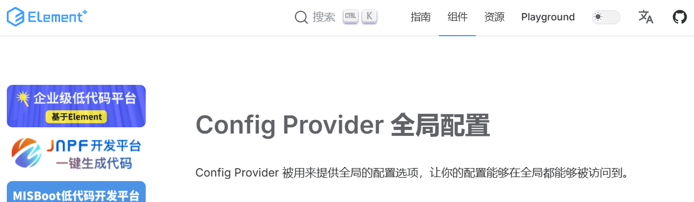
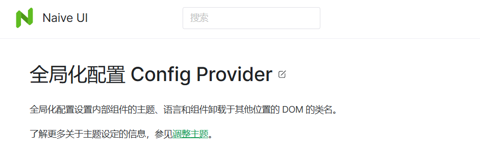
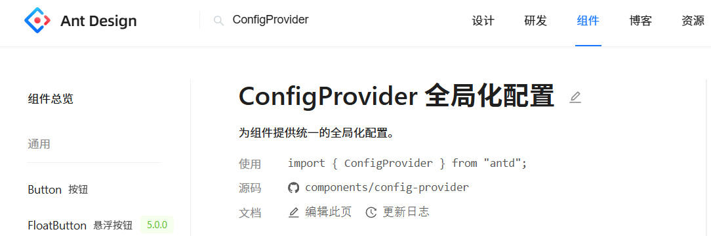

# 组件库全局配置之 ConfigProvider

## 依赖注入方式

- Vue3 采用 provide 和 inject 的方式
- React 采用 createContext 和 useContext 的方式

## 设置组件库整体配置

:::info 介绍
在众多的 vue 和 react 组件库中，基本都会通过依赖注入来实现国际化、主题配置、组件样式的整体调整。
:::

### ElementPlus（Vue3）

ElementPlus 组件库中提供了 ConfigProvider 组件，它可以接受一些基本配置，像 <font style="color:rgb(48, 49, 51);">locale 参数配置国际化，size 控制组件尺寸等等。然后它会通过 provide 将这些值传递给后代组件。只要是被它所包裹的子组件，都可以通过 inject 来获取到这些配置信息，利用这些配置信息就可以完成子组件的整体调整。（值得一提的是，这些被包裹的子组件中必然都对这些配置项值进行了 inject 操作）</font>



```typescript ElementPlus 示例代码
<template>
  <div>
    <div>
      <el-checkbox v-model="config.autoInsertSpace">
        autoInsertSpace
      </el-checkbox>
      <el-checkbox v-model="config.plain"> plain </el-checkbox>
      <el-checkbox v-model="config.round"> round </el-checkbox>
      <el-select v-model="config.type" class="ml-5" style="max-width: 150px">
        <el-option
          v-for="type in buttonTypes.filter(Boolean)"
          :key="type"
          :value="type"
        />
      </el-select>
    </div>
    <el-divider />
    <el-config-provider :button="config">
      <el-button>中文</el-button>
    </el-config-provider>
  </div>
</template>

<script lang="ts" setup>
import { reactive } from 'vue'
import { buttonTypes } from 'element-plus'

const config = reactive({
  autoInsertSpace: true,
  type: 'default',
  plain: true,
  round: true,
})
</script>
```

### NaiveUI（Vue3）

NaiveUI 组件库中提供了 NConfigProvider 组件，它也可以接收一系列的配置参数，原理跟 ElementPlus 相同，但它的配置参数更丰富，例如还提供 theme 属性，这样组件库的主题更容易自定义了。



```typescript NaiveUI 示例代码
<template>
  <n-config-provider :theme="theme">
    <n-card>
      <n-space>
        <n-button @click="theme = darkTheme">
          深色
        </n-button>
        <n-button @click="theme = null">
          浅色
        </n-button>
      </n-space>
    </n-card>
  </n-config-provider>
</template>

<script lang="ts">
import type { GlobalTheme } from 'naive-ui'
import { darkTheme } from 'naive-ui'
import { defineComponent, ref } from 'vue'

export default defineComponent({
  setup() {
    return {
      darkTheme,
      theme: ref<GlobalTheme | null>(null)
    }
  }
})
</script>
```

### Ant Design (React)

Ant Design 组件库中提供了 ConfigProvider 函数组件，它也提供了非常丰富的配置项，像 <font style="color:rgb(48, 49, 51);">locale 参数配置国际化</font>，theme 设置主题，variant 设置全局输入组件形态变体等。ConfigProvider 内部会通过 createContext 创建一个上下文，将配置参数通过上下文的形式传递给被包裹的子组件，子组件内部会通过 useContext 去接收这些配置，最后通过这些配置来完成组件库整体的统一。


```typescript Ant Design 示例代码
import React from 'react';
import { ConfigProvider } from 'antd';

// ...
const Demo: React.FC = () => (
  <ConfigProvider direction="rtl">
    <App />
  </ConfigProvider>
);

export default Demo;
```
