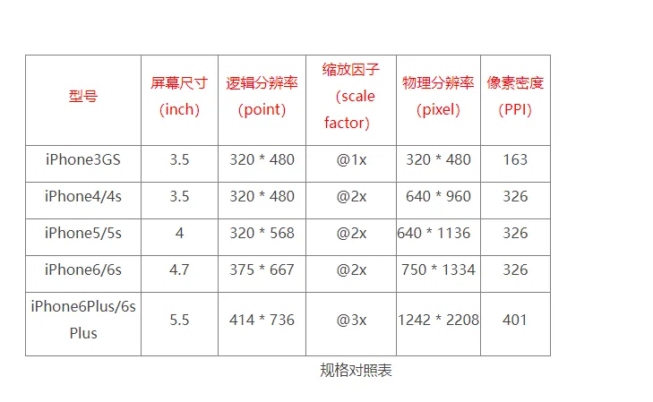

# 颜色编码与图像数据存储

设计师都是根据逻辑分辨率来给出设计图的，下面来解释一下逻辑分辨率和物理分辨率的区别。


## RGBA 颜色模型

### 基本概念

RGBA 是一种颜色空间模型，由以下四个通道组成：

- R（Red）：红色通道
- G（Green）：绿色通道
- B（Blue）：蓝色通道
- A（Alpha）：透明度通道

每个通道通常使用 8 位（1 字节）来表示，取值范围为 0-255，因此一个完整的 RGBA 颜色需要 4 字节（32 位）存储空间。

### 颜色表示

```javascript
// RGBA 颜色示例
const red = 'rgba(255, 0, 0, 1)' // 纯红色
const green = 'rgba(0, 255, 0, 0.5)' // 半透明绿色
const blue = 'rgba(0, 0, 255, 1)' // 纯蓝色
```

## 图像数据存储

### 位图存储原理

位图图像（也称为光栅图像）是由像素点阵列组成的。每个像素点都包含颜色信息，根据不同的颜色模式，每个像素占用的存储空间也不同：

1. 二值图像：每个像素只需 1 位
2. 灰度图像：每个像素通常使用 8 位
3. RGB 图像：每个像素使用 24 位（3 字节）
4. RGBA 图像：每个像素使用 32 位（4 字节）

### 图像文件格式

常见的图像文件格式及其特点：

1. PNG（Portable Network Graphics）

   - 支持无损压缩
   - 支持 Alpha 通道
   - 适合存储图标、截图等需要保持清晰度的图像

2. JPEG（Joint Photographic Experts Group）

   - 使用有损压缩
   - 不支持透明度
   - 适合存储照片等自然图像

3. WebP
   - 同时支持有损和无损压缩
   - 支持动画和 Alpha 通道
   - 具有更高的压缩率

## 视频帧率与显示

### 帧率概念

帧率（FPS，Frames Per Second）表示视频每秒显示的画面数量：

- 24 FPS：电影标准帧率
- 30 FPS：常见视频帧率
- 60 FPS：游戏常用帧率
- 120+ FPS：高刷新率显示器

### 显示原理

1. 垂直同步（V-Sync）

   - 同步显示器刷新率和图形输出
   - 避免画面撕裂现象
   - 可能导致输入延迟

2. 双缓冲技术
   - 前缓冲区：当前显示的画面
   - 后缓冲区：正在绘制的下一帧
   - 缓冲区交换时机：垂直同步信号

## 性能优化

### 图像优化策略

1. 选择合适的图像格式

   - 照片使用 JPEG
   - 图标使用 PNG 或 SVG
   - 考虑使用 WebP 作为替代方案

2. 合理的压缩策略
   - 平衡质量和文件大小
   - 使用响应式图片
   - 采用渐进式加载

### 渲染优化

1. GPU 加速

   - 使用 transform 代替位置变换
   - 合理使用硬件加速
   - 避免不必要的层叠

2. 内存管理
   - 及时释放不需要的图像资源
   - 使用图像精灵图（Sprite）
   - 实现图像懒加载

## 总结

:::tip
存储是计算机图形处理的基础。理解 RGBA 颜色模型、图像存储原理和视频帧率等概念，对于开发高性能的图形应用和优化显示效果至关重要。在实际应用中，需要根据具体场景选择合适的存储格式和优化策略，以达到最佳的显示效果和性能表现。
:::
