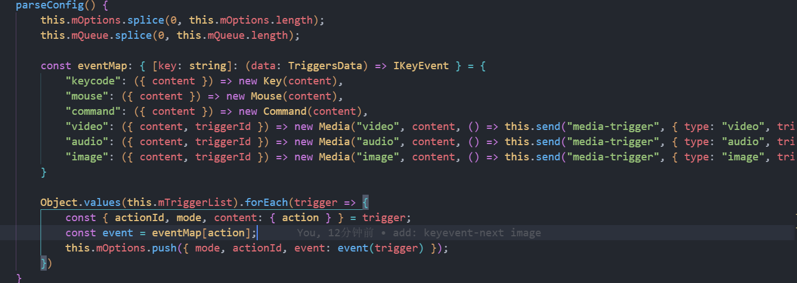

# 策略模式

策略模式，一般会跟策略映射表结合，如果说策略需要传递的参数不同，可以用工厂函数加上策略映射表的方式，非常好用。比起if...else可读性要好很多。
常见应用场景

1. 电子商务系统：

- 不同用户类型（普通用户、VIP 用户、超级 VIP 用户）有不同的折扣策略。
- 每个用户类型可能需要不同的参数（如折扣率、额外费用、忠诚度积分）。

2. 游戏开发：

- 不同游戏角色（战士、法师、猎人）有不同的技能和属性计算方式。
- 每个角色类型可能需要不同的参数（如攻击力、防御力、特殊技能）。
